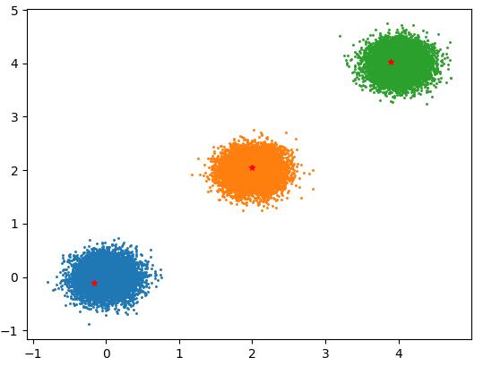
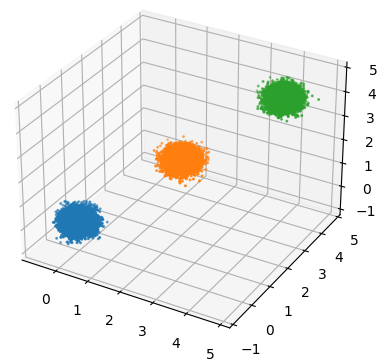
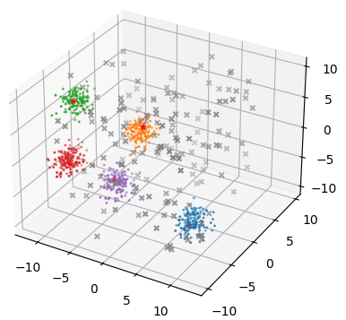

# CLUEstering 
The CLUE algorithm is a clustering algorithm written at CERN.

The original algorithm was designed to work in 2 dimensions, with the data distributed in parallel layers.
Unlike other clustering algorithms, CLUE takes the coordinates of the points and also their weight, which represents their energy, and calculater the energy density of each point.
This energy density is used to find the seeds for each cluster, their followers and the outliers, which are dismissed as noise.
CLUE takes 4 parameters in input: 
* dc_, which is the side of the box inside of which the density of a point is calculated;
* rhoc, which is the minimum energy density that a point must have to not be considered an outlier,
* outlierDeltaFactor, that multiplied by dc_ gives dm_, the side of the box inside of which the followers of a point are searched;
* pointsPerBin, which is the average number of points that are to be found inside a bin. This value allows to control the size of the bins.

This library generalizes the original algorithm, making it N-dimensional.

<p align="center">
     
</p>

The C++ code is binded using PyBind11, and the module is created locally during the installation of the library.

In this library is defined the clusterer class. The constructor takes the four parameters, dc_, rhoc, outlierDeltaFactor and pPBin. Passing pPBin is optional since by default it is initialized to 10.

The class has several methods:
* read_data, which takes the data in input and inizializes the class members. The data can be in the form of list, numpy array, dictionary, string containing the path to a csv file or pandas DataFrame;
* change_coordinates, which allows to change the coordinate system used for clustering;
* choose_kernel, which allows to change the convolution kernel used when calculating the local density of each point. The default kernel is a flat kernel with parameter `0.5`, but it can be changed to an exponential or gaussian kernel, or a custom kernel, which is user defined and can be any continuous function;
* run_clue, which takes no parameters and runs the CLUE algorithm;
* input_plotter, which plots all the points in input. This method is useful for getting an idea of the shape of the dataset before clustering. In addition to some plot customizations (like the colour or the size of the points, the addition of a grid, the axis labels and so on) it's also possible to pass the functions for the change of coordinates and change the coordinate system used for plotting.
* cluster_plotter, which plots the data using a different colour for each cluster. The seeds are indicated by stars and the outliers by small grey crosses.
* to_csv, which takes two strings, the first containing the path to a folder and the second containing the desired name for the csv file (also with the .csv suffix) and produces the csv file containing the cluster informations.

Outside of the class is also defined the function test_blobs, which takes the number of points and the number of dimensions, and is a way to test quickly the library, producing some N-dimensional blobs.

An expample of how the library should be used is:
```
import CLUEstering as c

clust = c.clusterer(1,5,1.5)
clust.read_data(c.test_blobs(1000,2))
clust.run_clue()
clust.cluster_plotter()
```
<p align="center">
     
</p>
