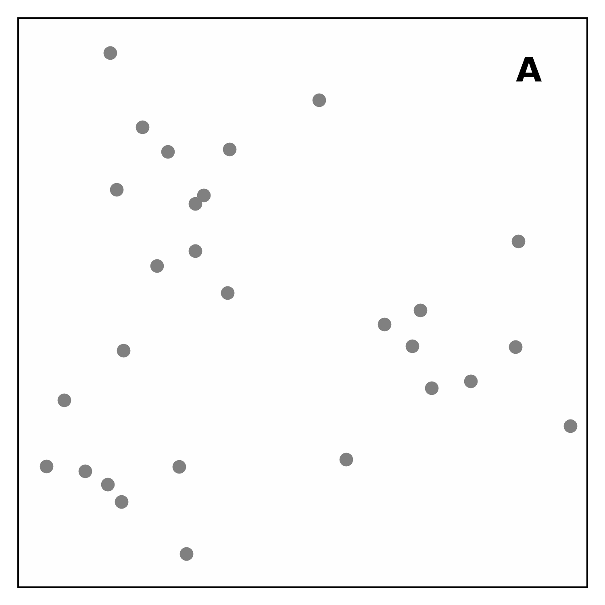

Introduction to CLUEstering
============================

Authors
-------

Simone Balducci, Felice Pantaleo, Marco Rovere, Wahid Redjeb, Aurora Perego, Francesco Giacomini

.. image:: images/docs/CLUEstering-logo.png
   :alt: CLUEstering logo
   :width: 600px

Overview
--------

CLUEstering is a C++ library designed for high-performance, multi-dimensional clustering.  
It is based on the CLUE algorithm, a highly parallel, density-based weighted clustering algorithm developed at CERN inside the CMS experiment.

Unlike many popular clustering algorithms, CLUEstering combines the flexibility of density-based clustering, which makes it robust to noisy data, with the generality of weighted clustering, allowing it to handle datasets where points have different relative importance.

Whereas most common density-based algorithms require weights to be applied by modifying the distance matrix or dataset, CLUEstering uses the weights directly in the computation of each point's density, providing better performance and more natural use of weights.

The CLUE algorithm is designed to be highly parallel and efficiently executed on modern hardware accelerators such as GPUs and FPGAs. CLUEstering's backend uses **alpaka**, a C++ performance portability library, to make the backend portable and automatically executable on many types of accelerators without code duplication. Its scalability makes it suitable for large datasets, especially on parallel hardware.

Description of the Algorithm
----------------------------

The algorithm proceeds in four main steps:

1. **Computation of the local density**  
   The local energy density for each hit is computed by searching for nearby hits and weighting them according to their distance and energy. Controlled by the parameter ``dc``.

2. **Computation of the nearest highers**  
   Each point is linked to the closest point with a greater local density, called its *nearest higher*, within a maximum distance ``dm``.

3. **Finding cluster centers**  
   Points without any nearest-higher are classified: those with density above a threshold ``rhoc`` become seeds (cluster centers), while others are marked as outliers.

4. **Assigning points to clusters**  
   Clusters are built by linking each point to its nearest-higher, leaving outliers unattached.

The CLUE algorithm takes three main parameters: ``dc``, ``rhoc``, and ``dm``.

